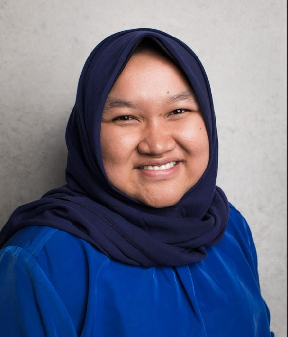

# Rabiah al Adawiyah

{ .person }

Rabiah al Adawiyah is a Research Fellow in the Global Health Infectious Diseases unit at The University of Melbourne. Her current work focuses on developing a multi-species malaria model to investigate the health impact and cost-effectiveness of different policy decisions across species of malaria. Her broader research interests include economic evaluation and health systems strengthening in infectious diseases. She is a qualified medical doctor and holds a PhD from UNSW. Previously, she worked for the Melbourne Sexual Health Centre and the Asian Development Bank.

[University Professional Page](https://findanexpert.unimelb.edu.au/profile/1128401-rabiah-al-adawiyah){ .md-button .md-button--primary }
