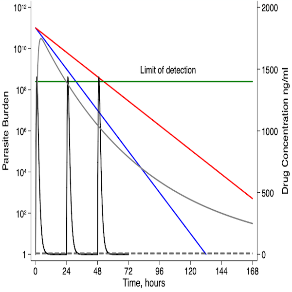
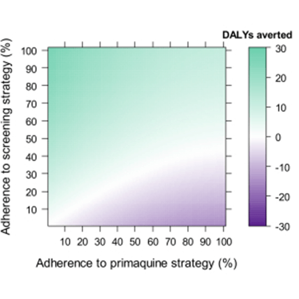
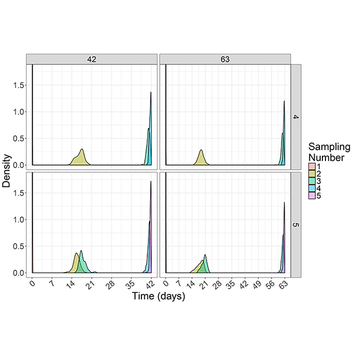
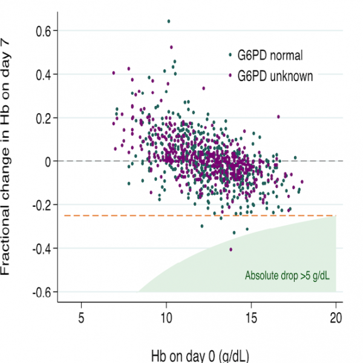

# Projects

We have developed biologically informed mathematical models for studying antimalarial drug action and cost-effectiveness models for evaluating screening tests used to determine the safety of the antimalarial treatment, primaquine.
Check out our online model simulation software tools to aid decision making regarding treatment regimens and screening tests.
Our models are validated on clinical and experimental data (see [the ACREME website](https://acreme.edu.au/who-we-are/) for our extensive network of collaborators) within a Bayesian framework using advanced MCMC algorithms.
To improve the design of future studies we have developed a software package that implements a Bayesian Optimal Design method.

- Within-host malaria modelling to improve the treatment of malaria
    {: .project .title }

    

    ---

    Artemisinin derivatives are the first line treatment for falciparum malaria.
    Alarmingly, resistance to these drugs has emerged in Southeast Asia, jeopardising malaria control.

    [:lucide-arrow-right: Read more](pkpd.md)

- Economic modelling to improve the management of malaria
    {: .project .title }

    

    ---

    A single infectious bite with vivax malaria can cause multiple malaria episodes through dormant liver parasites.
    Radical cure is needed to clear these liver parasites, but the drug can cause haemolysis in individuals with glucose-6-phosphate-dehydrogenase (G6PD) deficiency.

    [:lucide-arrow-right: Read more](cost-effectiveness.md)

- Optimal Resource Allocation in Clinical and Public Health Research
    {: .project .title }

    

    ---

    Optimising resource allocation is critical for maximising the value of data in clinical trials and epidemiological studies, particularly in resource-constrained settings.

    [:lucide-arrow-right: Read more](optimal-sampling.md)

- Advanced data analysis to inform optimal antimalarial dosing
    {: .project .title }

    

    ---

    We have used systematic reviews and individual patient data meta-analyses undertaken through collaboration with the WorldWide Antimalarial Resistance Network (WWARN) to improve our understanding of the risks and benefits of primaquine and tafenoquine and inform policymakers.

    [:lucide-arrow-right: Read more](radical-cure.md)

